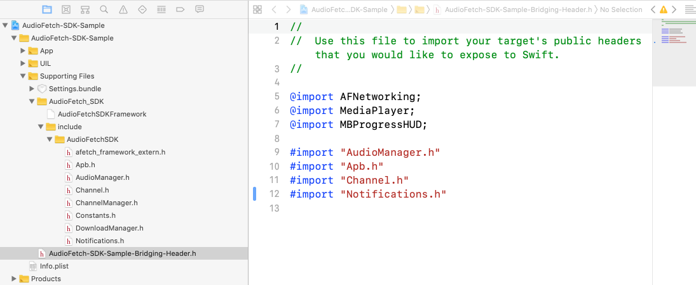
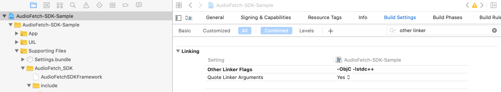
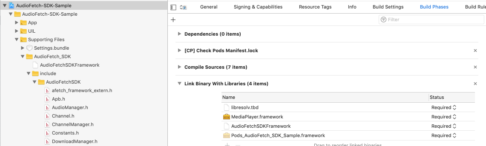

## AudioFetch iOS SDK Sample Application 

# Overview

The iOS SDK Sample Library incorporates the AudioFetch SDK library into a simple functioning App. This is an excellent starting point for developing a custom App based on AudioFetch.

# SDK Overview
The AudioFetch SDK allows developers to add the AudioFetch system channel discovery and audio management features directly to their third- party native iOS applications.

The SDK is delivered as a Universal Framework that includes both mobile and x86 simulator builds so that both may be used. The simulator is a fully functional development environment for Audiofetch and can help speed custom app development.

## To Integrate with your native iOS App
### Add the SDK package to your project

The SDK sample application is an excellent guide on how to integrate and use the SDK into your application. At the top level, you want to:

- Add the framework and include folder
- Link to external libraries
- Install AFNetworking from CocoaPods
- Create a Swift bridging header if needed

The framework can be integrated identically to the sample app:



Two items need to be added to the linker flags:



In Build Phases, add MediaPlayer.framework and libresolv. 



Also Add AFNetworking by adding the library manually or by using CocoaPods. Here’s a link describing how to add using [CocoaPods](https://cocoapods.org/pods/AFNetworking).

Finally, for a Swift Project, create a Bridging Header:

````
//
//  Use this file to import your target's public headers that you would like to expose to Swift.
//

@import AFNetworking;
@import MediaPlayer;
@import MBProgressHUD;

#import "AudioManager.h"
#import "Apb.h"
#import "Channel.h"
#import "Notifications.h"
````

### Integrate Audio Manager With Your App and ViewController

You primarily work with the Audiofetch AudioManager class to control SDK functionality. The SDK sample app gets a reference to it in the AppDelagate.swift file:

    lazy var audioMgr = AudioManager.shared


And, then uses that reference from ViewController.swift to make calls:

    self.app.audioMgr.startAudio()
    self.app.audioMgr.stopAudio()

Setting a channel is also accomplished via the audioMgr object:

    if self.app.audioMgr.hasChannel(curCnl) {
        self.app.audioMgr.currentChannel = curCnl
    }

Volume can also be set:

    self.app.audioMgr.volume = volume

The channel will automatically be set to the first channel found during discovery, or setting channel numbers and volume can be done from viewDidLoad().


### Discovery and Notifications

When the AudioManager starts, the discovery process starts automatically, this lasts for a number of seconds. When the discovery process finishes, your app receives a notification and a list of channels is given to your app. These are the available audiofetch channels.

Notifications are set up on app startup. In the sample app, the ViewController class does this in the viewWillAppear method, which calls initNotifications, which adds observers for multiple notifications:

````
    func initNotifications() {
        let notificationsToObserve = [
            NSNotification.Name.channelsLoaded,
            NSNotification.Name.deviceDiscoveryFailed,
            NSNotification.Name.forwardPressed,
            NSNotification.Name.backwardPressed,
            NSNotification.Name.networkConnection,
            NSNotification.Name.hardwareButtonVolume
        ]
        for notification in notificationsToObserve {
            notify.addObserver(self, selector: #selector(ViewController.handleNotifications(_:)), name: notification, object: nil)
        }
    }
````

The channelsLoaded notification happens at the end of discovery, and the list of channels it provides can be used to populate UI elements to implement channel changing.


### AudioManager API

| AudioManager | Notes |
| ------------ | ----- |
| startAudio() | Start Playback of audio |
| stopAudio() | Stop Playback of audio |
| isAudioPlaying | true if audio is now playing |
| volume | get/set playback volume |
| currentChannel | get/set playing channel |
| hasChannel(chNum) | true if the chNum exists | 
| allApbs[] | Array of all AudioFetch boxes found during discovery. |


## Building and Running

Build and Run your app to the simulator or device. Provided you have audio input plugged into the first (number 1) channel spot on the AudioFetch hardware device, your app should now be playing the audio of the first channel at 50% iOS device volume.

#### Note: This library has a dependency on [AFNetworking](https://cocoapods.org/pods/AFNetworking)


